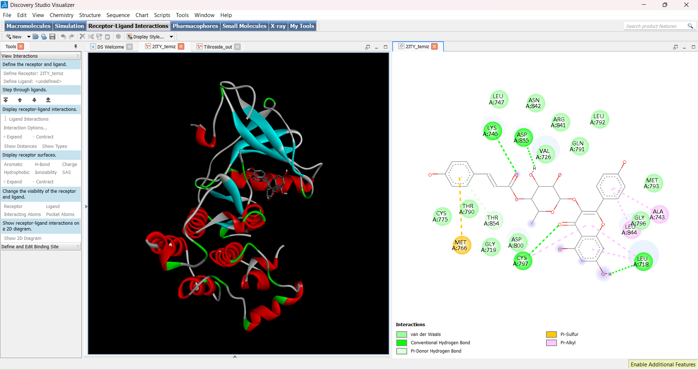

# Molecular Docking Results: EGFR Kinase Domain (PDB: 2ITY)

This page documents the computed binding affinities and interaction potentials of *Rubus caesius* secondary metabolites against the human EGFR kinase domain, a major target in oncology.

## Binding Affinity Data

The virtual screening simulation was performed using AutoDock Vina. The results indicate strong binding potentials for the majority of the selected phytochemicals:

| Rank | Compound Name | PubChem CID | Binding Affinity (kcal/mol) | Status |
| :---: | :--- | :---: | :---: | :--- |
| 1 | **Tiliroside** | 5320701 | **-8.9** | ⭐ Top Lead / Exceptional Affinity |
| 2 | **Ellagic acid** | 5281855 | **-8.2** | Strong Binder |
| 3 | **Hyperoside** | 5281643 | **-8.1** | Strong Binder |
| 4 | **Rutin** | 5280805 | **-8.0** | Strong Binder |
| 5 | **Gallic acid** | 370 | **-6.0** | Moderate/Weak Binder |

## Key Insights & Chemical Discussion

*   **Tiliroside (-8.9 kcal/mol):** The presence of multiple aromatic rings and glycosidic linkages allows this molecule to establish extensive hydrophobic networks and hydrogen bonds deep within the ATP-binding pocket of EGFR.
*   

*   **Gallic acid (-6.0 kcal/mol):** Due to its significantly lower molecular weight and smaller structural footprint, it occupies only a fraction of the binding cleft, leading to fewer stabilizing interactions compared to larger flavonoids like Rutin or Hyperoside.

## Vina Configuration Parameters
*   **Grid Center:** X: -50.9528, Y: -2.5602, Z: -25.3906
*   **Search Space Size:** 40 x 40 x 40 Å
*   **Exhaustiveness:** 8
